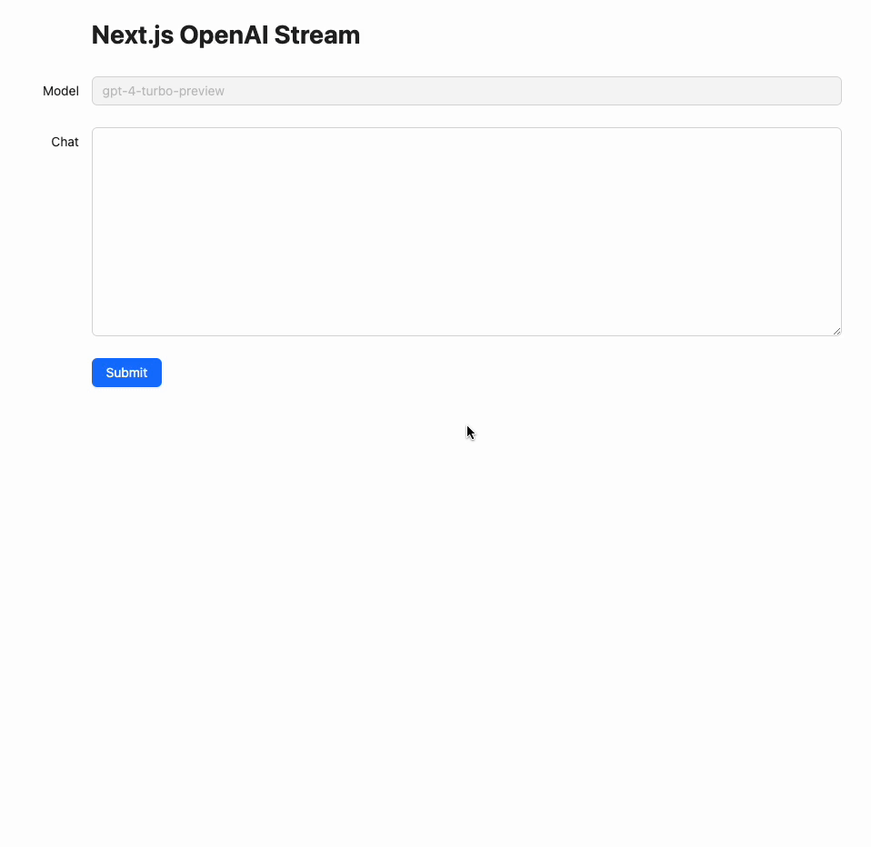

# nextjs-openai-stream
This project is a sample app to chat with `ChatGTP` using `OpenAI`'s API.

## Run locally
First, install the dependent packages.

```bash
$ yarn
➤ YN0000: · Yarn 4.1.0
➤ YN0000: ┌ Resolution step
➤ YN0000: └ Completed
➤ YN0000: ┌ Fetch step
➤ YN0000: └ Completed in 0s 347ms
➤ YN0000: ┌ Link step
➤ YN0000: └ Completed in 5s 360ms
➤ YN0000: · Done in 5s 880ms
```

All you have to do is launch the application.

```bash
$ yarn dev
   ▲ Next.js 14.1.0
   - Local:        http://localhost:3000
   - Environments: .env.local

 ✓ Ready in 1170ms
```

## Deploy to AWS
Install `AWS SAM CLI` in advance by referring to the following link.

- [Installing the AWS SAM CLI - AWS Serverless Application Model](https://docs.aws.amazon.com/serverless-application-model/latest/developerguide/install-sam-cli.html)

The first time you deploy, `make deploy` with the following parameters.

- `profile`: AWS profile
- `openai_api_key`: OpenAI API key

```bash
$ make deploy profile=${AWS_PROFILE} openai_api_key="${OPENAI_API_KEY}"
```

```bash
sam build --no-cached
Building codeuri: /Users/motohiro/Projects/yields-llc/nextjs-openai-stream runtime: None metadata: {'DockerTag': 'v1', 'DockerContext': '/Users/motohiro/Projects/yields-llc/nextjs-openai-stream', 'Dockerfile': 'Dockerfile'} architecture: x86_64 functions: NextFunction
Building image for NextFunction function
Setting DockerBuildArgs: {} for NextFunction function

...(building app)
```

Then, when build and deployment is complete, the Lambda URL will be output as shown below, which can be accessed.

```bash
CloudFormation outputs from deployed stack
------------------------------------------------------------------------------------------------------------------------------------------------------------------------------------------------------------------------------------------------
Outputs                                                                                                                                                                                                                                        
------------------------------------------------------------------------------------------------------------------------------------------------------------------------------------------------------------------------------------------------
Key                 NextFunctionUrl                                                                                                                                                                                                            
Description         -                                                                                                                                                                                                                          
Value               https://{LAMBDA_URL_ID}.lambda-url.{AWS_REGION}.on.aws/                                                                                                                                                 

Key                 NextFunction                                                                                                                                                                                                               
Description         -                                                                                                                                                                                                                          
Value               arn:aws:lambda:{AWS_REGION}:{AWS_ACCOUNT_ID}:function:nextjs-openai-stream-NextFunction-{FUNCTION_ID}                                                                                                                            
------------------------------------------------------------------------------------------------------------------------------------------------------------------------------------------------------------------------------------------------


Successfully created/updated stack - nextjs-openai-stream in {AWS_REGION}
```

The top page should appear as shown below.


